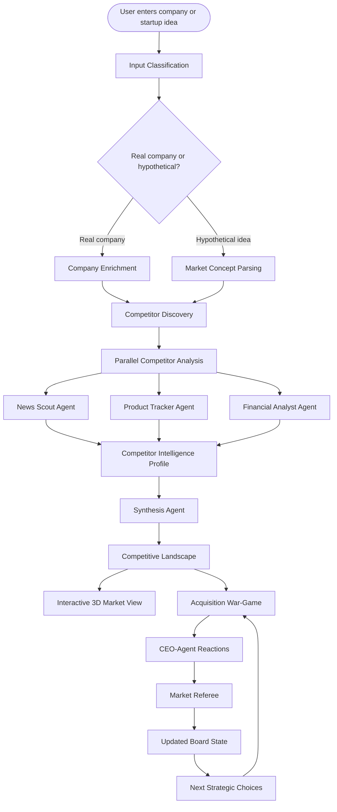

# StrategyOS — Continuous Competitive Intelligence Engine

> **An AI-powered competitive intelligence and acquisition war-game simulator.**  
> Enter a real company or startup idea. A swarm of specialized agents builds a live competitive landscape, analyzes market threats, and lets you simulate acquisition strategies against autonomous CEO-style digital twins of major incumbents.

[](https://youtu.be/3YyY5HNPcbU)

---

## Why StrategyOS?

Competitive intelligence is usually slow, manual, and outdated by the time it reaches decision-makers. StrategyOS changes that by combining:

| Capability                         | Description                                              |
| ---------------------------------- | -------------------------------------------------------- |
| 🤖 Multi-agent AI research         | Specialized agents running in parallel across dimensions |
| 🔍 Real-time competitor discovery  | Live discovery grounded in public data                   |
| 📊 Source-grounded market analysis | Financial, product, and strategic signals with citations |
| 🎮 Acquisition war-game simulation | CEO digital twins that react autonomously to your moves  |
| 🔎 Auditable AI traces             | End-to-end reasoning you can inspect and replay          |
| 🌐 Interactive 3D visualization    | Boardroom-ready competitive landscape maps               |

The result is a system that doesn't just describe the market — it helps you **stress-test strategic moves before making them.**

---

## What StrategyOS Does

StrategyOS operates in two major layers.

### Layer 1 — Competitive Intelligence

Enter any company or startup idea:

```
"Analyze Stripe"
"I am building an AI legal document review platform for mid-size law firms"
"Compare a new fintech startup against the current payment infrastructure market"
```

The system:

1. Classifies whether the input is a real company or a hypothetical idea
2. Discovers relevant competitors automatically
3. Runs multiple specialist agents across each competitor **in parallel**
4. Collects news, product, financial, and strategic signals
5. Scores the quality of the intelligence collected
6. Synthesizes a final competitive landscape

### Layer 2 — Acquisition War-Game

Once the competitive landscape is built, major incumbents become **autonomous CEO-style agents** that react to your acquisition moves based on:

- Company strategy and market position
- Financial strength and historical behavior
- Competitive pressure and ecosystem risk
- Regulatory exposure

A **Market Referee** adjudicates each round and updates the board state.

**Simulate questions like:**

- What happens if we acquire a fast-growing AI startup?
- Would Apple, Microsoft, Google, Amazon, Meta, or Nvidia counter-bid?
- Which incumbent is most likely to partner, retaliate, or apply regulatory pressure?
- Is this acquisition strategically defensible?

---

## Core Agent Architecture

StrategyOS uses a multi-agent architecture where each agent has a narrow, auditable responsibility — making the system more reliable, easier to evaluate, and easier to debug.

### Intelligence Agents

| Agent                 | Role                                                                                                                |
| --------------------- | ------------------------------------------------------------------------------------------------------------------- |
| **Orchestrator**      | Coordinates the entire workflow — classifies input, routes tasks, discovers competitors, manages parallel execution |
| **News Scout**        | Searches for fresh news, market events, launches, partnerships, and competitive signals                             |
| **Product Tracker**   | Finds product offerings, pricing signals, positioning, and feature-level competitor data                            |
| **Financial Analyst** | Extracts financial signals — funding, revenue, valuation, market cap, and business strength                         |
| **Synthesis Agent**   | Combines all findings into SWOT analysis, threat scores, market quadrants, and executive summaries                  |

### War-Game Agents

| CEO Agent          | Perspective                                                                              |
| ------------------ | ---------------------------------------------------------------------------------------- |
| **Microsoft**      | Strategic platform incumbent — enterprise, cloud, and AI leverage                        |
| **Alphabet**       | Search, ads, cloud, and AI ecosystem                                                     |
| **Amazon**         | Cloud, commerce, logistics, and infrastructure strategy                                  |
| **Apple**          | Ecosystem control, privacy posture, hardware/software integration, brand moat            |
| **Meta**           | Social, ads, AI, and platform competition                                                |
| **Nvidia**         | AI infrastructure, chips, compute, and platform leverage                                 |
| **Market Referee** | Judges all CEO-agent reactions, updates the board state, produces next strategic choices |

### Why Multiple Agents?

A single agent handling discovery, research, synthesis, and simulation all at once makes outputs harder to trust and harder to debug. By splitting into specialized agents:

- Each agent focuses on one type of reasoning
- Each output can be scored independently
- Errors are easier to trace and isolate
- Competitor analysis runs in **parallel**
- The war-game becomes interactive instead of static

---

## System Dataflow



---

## Observability and Trust

StrategyOS is built on the principle that **AI-generated intelligence must be auditable.**

The system uses **W&B Weave** as the trust and quality layer, providing:

- End-to-end traces of agent reasoning
- Quality scoring for freshness, relevance, product coverage, and completeness
- Guardrails for stale news and unsourced financial claims
- Evaluation datasets for repeatable testing
- Leaderboards for prompt and policy comparison
- Trace replay for war-game decisions

Users can inspect not only the final answer, but **how the system reached it.**

---

## Memory and Decision Ledger

**Redis** serves as the system's memory and state layer, supporting:

- Cross-session memory and competitor intelligence storage
- Semantic retrieval and LLM response caching
- War-game decision history and replayable strategy turns

Together, Redis and Weave form a two-part audit system:

```
Redis   → stores what happened
Weave   → explains why it happened
```

---

## Key Features

- Real and hypothetical company analysis
- Automatic competitor discovery
- Parallel multi-agent research
- Source-grounded market intelligence
- Product and pricing signal extraction
- Financial signal analysis
- SWOT and market quadrant generation
- Interactive 3D competitive landscape
- Acquisition war-game simulation with CEO digital twins
- Market referee adjudication
- Replayable decision history
- Quality scoring and hallucination guardrails
- Prompt evaluation and leaderboard support

---

## Example Use Cases

**Corporate Strategy**  
Test how incumbents might react before pursuing an acquisition.

**Competitive Intelligence**  
Monitor competitor movement, product launches, and market positioning continuously.

**Founders**  
Enter a startup idea and instantly understand the real competitive landscape before building.

**Venture Capital & Private Equity**  
Stress-test market entry or acquisition theses against incumbent reactions.

**Higher Education & Research**  
Study multi-agent systems, responsible AI, agent observability, and AI-assisted strategic reasoning.

---

## Tech Stack

| Layer                      | Technology            |
| -------------------------- | --------------------- |
| Agent Orchestration        | LangGraph             |
| Reasoning & Simulation     | Large language models |
| Application Services       | FastAPI               |
| Agent-Native UI Patterns   | CopilotKit            |
| Memory, Caching & Search   | Redis                 |
| Traces, Evals & Guardrails | W&B Weave             |
| Live Public Data           | Tavily web search     |
| Visualization              | React + 3D rendering  |

---

## What Makes StrategyOS Different?

Most competitive intelligence tools are dashboards.  
**StrategyOS is an agentic simulation engine.**

It doesn't only answer:

> _"Who are my competitors?"_

It also answers:

> _"What happens if I make this move — and how will the market fight back?"_

That is the difference between static reporting and **strategic intelligence.**

---
