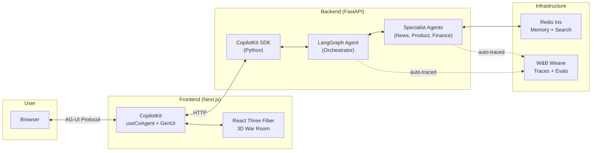
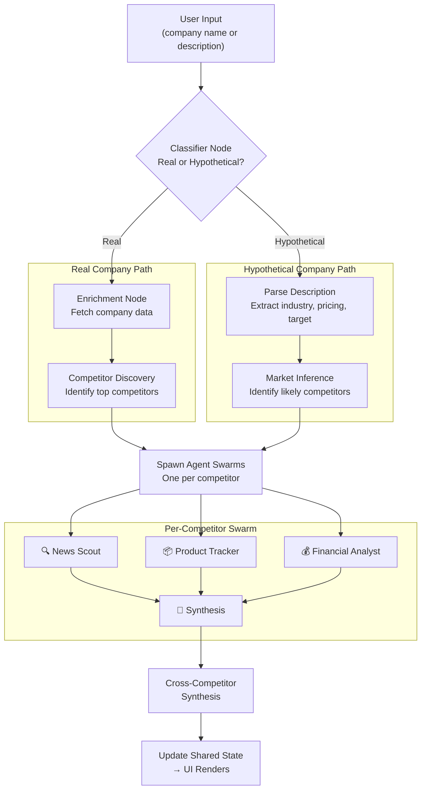

# CCIE — Continuous Competitive Intelligence Engine

## What We're Building

A system where you type a company name (real or imagined) and a **swarm of specialist AI agents** fans out to build a complete competitive landscape — surfacing competitors, analyzing each one, and rendering the entire battlefield as an interactive **3D city map** that updates in real-time as agents discover intel.

> [!IMPORTANT]
> **Key differentiator:** Works for *existing* companies (agents scrape live data) AND *hypothetical* companies (user describes what it would do → agents infer the competitive landscape and analyze it). This makes CCIE both a competitive intelligence tool and a startup market validation tool.

---

## Revised Tech Stack — Simplest Possible

The critical insight: **CopilotKit's CoAgents are built on LangGraph**. Using LangGraph gives us native shared state, generative UI, and AG-UI protocol *for free*. No glue code.

| Layer | Technology | Why This, Not Something Else |
|---|---|---|
| **Agent Orchestration** | **LangGraph** (Python) | Native CopilotKit CoAgent integration. Shared state syncs agent ↔ UI bidirectionally. W&B Weave has first-class LangGraph tracing. |
| **Frontend** | **Next.js** + **CopilotKit** + **React Three Fiber** | CopilotKit renders agent state as React components. R3F handles the 3D. One framework, one language (TS). |
| **API Bridge** | **FastAPI** | Thin bridge — `add_fastapi_endpoint(app, sdk, "/api/copilotkit")`. ~10 lines of code. |
| **Memory** | **Redis Iris** | Agent Memory (cross-session), Context Retriever (MCP tools), Vector Search, LangCache. |
| **Observability** | **W&B Weave** | Auto-traces LangGraph nodes/edges. Custom scorers. Leaderboard. Guardrails. |
| **LLM** | **OpenAI GPT-4o** | Sponsor. Fast, cheap, great for tool-use and structured output. |

> [!TIP]
> **Why LangGraph over CrewAI?** CopilotKit's `useCoAgent` hook directly subscribes to LangGraph agent state. With CrewAI, we'd need custom websocket plumbing to sync agent progress to the UI. LangGraph + CopilotKit = real-time UI updates with zero extra code.

### The Stack at a Glance



---

## Flexible Company Input — The Two Modes

### Mode 1: Existing Company
```
User: "Analyze Stripe"
→ System identifies Stripe as a real company
→ Agents scrape: news, product pages, pricing, financials, social sentiment
→ Agents auto-discover competitors (PayPal, Adyen, Square, etc.)
→ Each competitor gets its own agent swarm
→ Results render on 3D map
```

### Mode 2: Hypothetical Company
```
User: "I'm building an AI-powered legal document review platform 
       targeting mid-size law firms, $50-200/month pricing"
→ System recognizes this is a hypothetical company
→ Agents infer the competitive landscape:
  - Who are the existing players? (Kira Systems, Luminance, Harvey AI, etc.)
  - What would the market positioning look like?
  - Where are the gaps and opportunities?
→ Each discovered competitor gets analyzed by agent swarm
→ Results render on 3D map with the user's company at center
```

### How It Works (LangGraph Flow)



---

## Specialist Agents

Each agent is a **LangGraph subgraph** with tools and memory.

| Agent | Role | Tools | Stores in Redis |
|---|---|---|---|
| 🔍 **News Scout** | Latest news, press releases, events | `web_search`, `news_api` | News items with timestamps + sentiment |
| 📦 **Product Tracker** | Products, features, pricing, launches | `web_scrape`, `product_compare` | Feature lists, pricing tables, changelogs |
| 💰 **Financial Analyst** | Revenue, market cap, funding, growth | `financial_data`, `web_search` | Financial metrics, growth trends |
| 🧠 **Synthesis** | Aggregate all intel into insights | `redis_query`, `vector_search` | SWOT analysis, executive summary, competitive positioning |

> [!NOTE]
> **MVP scope: Start with News Scout + Product Tracker only.** Add Financial Analyst in Phase 2. Synthesis is the glue — it always exists.

---

## 3D War Room — Visualization Design

### The Metaphor: City Skyline

The target company sits at the center. Competitors are buildings around it. The 3D scene updates in real-time as agents discover and analyze competitors.

### Visual Encoding

| Visual Property | Maps To | Example |
|---|---|---|
| **Building height** | Competitive threat level (composite score) | Taller = bigger threat |
| **Building color/glow** | Sentiment (from news + social) | Green = positive momentum, Red = negative, Blue = neutral |
| **Building size (width)** | Market presence / company size | Wider = larger company |
| **Floating particles** | Active agent data flow | Particles stream from buildings being analyzed |
| **Distance from center** | Market overlap with target | Closer = more direct competitor |
| **Labels** | Company name + key metric | Hover for details |

### Interaction

- **Click building** → Side panel with full competitive analysis (GenUI components)
- **Hover** → Quick summary tooltip
- **Zoom/rotate** → Navigate the competitive landscape
- **Watch buildings appear** → As agents discover new competitors, buildings animate up from the ground

### CopilotKit Integration

The 3D scene subscribes to LangGraph shared state:

```tsx
// Frontend: 3D scene reads agent state in real-time
const { state } = useCoAgent({ name: "competitor_intel" });

// state.competitors = [
//   { name: "PayPal", threat: 0.85, sentiment: 0.6, size: 0.9, ... },
//   { name: "Square", threat: 0.7, sentiment: 0.8, size: 0.6, ... },
// ]
// → Each entry becomes a building in the 3D scene
```

### Two Views

1. **Competitor View** (click a building): Deep-dive into one competitor
   - SWOT table (GenUI component)
   - News timeline (GenUI component)
   - Feature comparison (GenUI component)
   - Financial chart (GenUI component)

2. **Landscape View** (zoom out): Overall competitive landscape
   - All competitors as buildings
   - Market quadrant overlay (leader/challenger/niche/visionary)
   - Trend lines connecting related competitors

---

## Project Structure (Simplified)

```
ccie/
├── frontend/                        # Next.js + TypeScript
│   ├── app/
│   │   ├── page.tsx                 # Main entry — the war room
│   │   ├── layout.tsx               # CopilotKit provider wrapper
│   │   └── api/copilotkit/
│   │       └── route.ts             # Proxy to Python backend
│   ├── components/
│   │   ├── WarRoom.tsx              # 3D scene container
│   │   ├── CompetitorBuilding.tsx   # Individual 3D building
│   │   ├── CompanyInput.tsx         # Company name / description input
│   │   ├── CompetitorCard.tsx       # GenUI: competitor detail card
│   │   ├── SWOTTable.tsx            # GenUI: SWOT analysis
│   │   ├── NewsTimeline.tsx         # GenUI: news feed
│   │   └── AgentActivityFeed.tsx    # Live agent status stream
│   └── styles/
│       └── globals.css              # Dark mode + premium styling
│
├── backend/                         # Python
│   ├── main.py                      # FastAPI + CopilotKit SDK mount
│   ├── agents/
│   │   ├── orchestrator.py          # Main LangGraph — classifier + router
│   │   ├── news_scout.py            # News agent subgraph
│   │   ├── product_tracker.py       # Product agent subgraph
│   │   ├── financial_analyst.py     # Finance agent subgraph
│   │   └── synthesis.py             # Cross-agent synthesis
│   ├── tools/
│   │   ├── web_search.py            # Web search tool
│   │   ├── web_scrape.py            # Page scraping tool
│   │   └── financial_data.py        # Financial data fetcher
│   ├── memory/
│   │   └── redis_client.py          # Redis Iris integration
│   ├── observability/
│   │   └── weave_config.py          # W&B Weave setup + scorers
│   └── state.py                     # Shared CopilotKit state schema
│
├── docker-compose.yml               # Redis
├── requirements.txt
├── package.json
└── README.md
```

---

## Sponsor Integration — Why Each is FOUNDATIONAL

### Redis Iris — Real-time Competitive Memory 🧬

| Feature | How CCIE Uses It | Why It Can't Be Replaced |
|---|---|---|
| **Agent Memory** | Each agent remembers past analyses. Re-analyzing Stripe tomorrow shows *changes* since yesterday. | Without persistence, every analysis starts from zero. No delta detection. |
| **Context Retriever** | Define `Company`, `Competitor`, `NewsItem`, `Product` schemas → auto-generate MCP tools agents call. | Agents dynamically query structured competitive data without custom API code. |
| **Vector Search** | Synthesis agent semantically searches: "What competitors are pivoting to AI?" across all stored intel. | Keyword search can't find thematic patterns across competitors. |
| **LangCache** | Cache repeated queries (e.g., "What does Stripe do?" asked by multiple agents). | Saves tokens, reduces latency when swarm agents ask overlapping questions. |

### W&B Weave — Intelligence Quality Assurance 🧪

| Feature | How CCIE Uses It | Why It Can't Be Replaced |
|---|---|---|
| **LangGraph auto-tracing** | Every node, edge, tool call, LLM interaction traced automatically. | Debug why an agent missed a competitor or produced bad intel. |
| **Custom scorers** | Score each agent's output: freshness (is the data current?), accuracy (does it match reality?), relevance (is it useful?). | Quality control on AI-generated competitive intel. |
| **Leaderboard** | Compare different prompt configurations or models for each agent role. | Systematically improve agent quality during the hackathon. |
| **Guardrails** | Flag hallucinated financial figures, outdated news presented as current. | Critical for business intelligence — wrong numbers = wrong decisions. |

### CopilotKit — The Agent-Native Interface 🎮

| Feature | How CCIE Uses It | Why It Can't Be Replaced |
|---|---|---|
| **CoAgents + shared state** | LangGraph agent state streams to React in real-time via `useCoAgent`. 3D buildings appear as agents find competitors. | No other framework provides bidirectional agent ↔ UI state sync this cleanly. |
| **Generative UI** | Agents render SWOT tables, news feeds, charts as React components inline. | Users see rich, interactive intel — not just text. |
| **AG-UI Protocol** | Standard protocol for agent-to-UI communication. | Eliminates custom websocket/SSE plumbing. |
| **Components as Tools** | 3D building component is a "tool" the agent calls: `render_building(name, threat, sentiment)`. | Agent decides *what* to show and *when* — UI is a first-class output. |

---

## MVP Phases

### Phase 1: Skeleton (Day 1, Hours 1-4) 🦴
**Goal:** User types "Stripe" → one agent runs → result shows in chat.

- [ ] Next.js + CopilotKit scaffold (frontend)
- [ ] FastAPI + CopilotKit SDK + LangGraph (backend)
- [ ] Single agent: News Scout (web search → returns news for a company)
- [ ] Redis basic setup (store agent output as JSON)
- [ ] W&B Weave initialized (auto-tracing on)
- [ ] CopilotKit chat showing agent results as text

### Phase 2: Intelligence (Day 1, Hours 4-10) 🧠
**Goal:** Multiple agents, competitor discovery, Redis Iris memory, first GenUI components.

- [ ] Company classifier (real vs hypothetical)
- [ ] Competitor discovery agent (finds top 3-5 competitors)
- [ ] Product Tracker agent
- [ ] Redis Iris: Agent Memory + Context Retriever schemas
- [ ] Weave scorers (freshness, relevance)
- [ ] GenUI components: CompetitorCard, basic data display
- [ ] Shared state flowing: agent discovers competitor → UI knows

### Phase 3: The Wow (Day 2, Hours 1-8) ✨
**Goal:** 3D war room, multi-competitor swarms, polish for demo.

- [ ] React Three Fiber: 3D scene with buildings
- [ ] Buildings animate up as agents discover competitors
- [ ] Click building → detail panel (GenUI components: SWOT, news, features)
- [ ] Financial Analyst agent (stretch)
- [ ] Synthesis agent: cross-competitor analysis
- [ ] Weave leaderboard visible in demo
- [ ] Vector search: "Which competitor is strongest in X?"
- [ ] Demo flow polish, edge cases, presentation

---

## 3-Person Team Distribution

### 👤 Person 1: "Agent Architect" — LangGraph + W&B Weave
*Owns: All Python agent code, LangGraph graph design, Weave integration*

| Day 1 | Day 2 |
|---|---|
| LangGraph orchestrator scaffold | Financial Analyst agent |
| Company classifier node (real vs hypothetical) | Synthesis agent (cross-competitor) |
| News Scout agent + web search tools | Multi-competitor parallel swarms |
| Product Tracker agent + scraping tools | Weave scorers + leaderboard |
| Competitor discovery agent | Prompt optimization using Weave traces |
| Weave auto-tracing setup | Bug fixes, demo polish |

**Deliverables:** Working agent swarm, Weave dashboard with traces + evals

---

### 👤 Person 2: "Memory & Infra Engineer" — Redis Iris + FastAPI
*Owns: Redis Iris integration, data schemas, API layer, state management*

| Day 1 | Day 2 |
|---|---|
| Redis Iris setup (Docker or Cloud) | LangCache for token optimization |
| FastAPI + CopilotKit SDK endpoint | Multi-competitor data partitioning |
| CopilotKitState schema (shared state definition) | Vector search: semantic queries |
| Agent Memory (session + cross-session) | Real-time data sync optimization |
| Context Retriever + MCP tool generation | End-to-end integration testing |
| Data schemas: Company, Competitor, News, Product | Demo data seeding, edge cases |

**Deliverables:** Redis Iris powering memory + search, real-time state sync working

---

### 👤 Person 3: "Frontend Wizard" — CopilotKit + 3D Visualization
*Owns: Next.js frontend, CopilotKit integration, React Three Fiber 3D scene*

| Day 1 | Day 2 |
|---|---|
| Next.js + CopilotKit scaffold | **3D War Room** (React Three Fiber) |
| Company input form (real + hypothetical modes) | Competitor buildings + animations |
| `useCoAgent` hook wired to backend | Click-to-inspect → detail panel |
| Chat panel with agent responses | Particle effects, glow, transitions |
| GenUI components: CompetitorCard, NewsTimeline | Landscape vs competitor view toggle |
| Dark mode, premium styling, layout | Demo sequence, responsive polish |

**Deliverables:** Stunning 3D war room, GenUI components, demo-ready experience

---

## Integration Checkpoints

> [!IMPORTANT]
> Integration kills hackathon teams. Schedule explicit sync points.

| When | What | Who |
|---|---|---|
| **Day 1, Hour 4** | Agent output → shows in CopilotKit chat | All 3 |
| **Day 1, Hour 7** | Agent output → stored in Redis → queryable | P1 + P2 |
| **Day 1, Hour 9** | Shared state → GenUI components render agent data | P1 + P3 |
| **Day 2, Hour 3** | 3D buildings appear when agents discover competitors | All 3 |
| **Day 2, Hour 6** | Full demo dry run | All 3 |

---

## Shared State Schema (The Contract)

This is the **single most important file** — it's the contract between backend agents and frontend UI. Define it first.

```python
# backend/state.py
from copilotkit import CopilotKitState
from typing import Optional

class Competitor(dict):
    """A discovered competitor"""
    name: str                    # "PayPal"
    description: str             # "Digital payments platform..."
    threat_level: float          # 0.0-1.0
    sentiment: float             # -1.0 to 1.0
    market_size: float           # 0.0-1.0 (relative)
    market_overlap: float        # 0.0-1.0 (distance from target)
    status: str                  # "discovering" | "analyzing" | "complete"
    news: list                   # Latest news items
    products: list               # Product/feature list
    financials: dict             # Key financial metrics
    swot: dict                   # Strengths, weaknesses, opportunities, threats

class CCIEState(CopilotKitState):
    """Shared state between LangGraph agents and CopilotKit frontend"""
    # Target company
    target_company: str = ""
    target_description: str = ""
    is_hypothetical: bool = False
    
    # Discovered competitors (this drives the 3D scene)
    competitors: list[Competitor] = []
    
    # Overall analysis
    landscape_summary: str = ""
    market_quadrants: dict = {}   # leader/challenger/niche/visionary
    
    # Agent activity (drives the activity feed)
    agent_activity: list = []     # [{"agent": "News Scout", "status": "Scanning PayPal...", "ts": ...}]
    
    # Analysis status
    phase: str = "idle"           # "idle" | "classifying" | "discovering" | "analyzing" | "synthesizing" | "complete"
```

```tsx
// Frontend reads this state via useCoAgent
const { state } = useCoAgent<CCIEState>({ name: "ccie_agent" });

// state.competitors → renders buildings in 3D scene
// state.agent_activity → renders activity feed
// state.phase → drives loading animations
```

---

## Risk Mitigation (Updated)

| Risk | Mitigation | Owner |
|---|---|---|
| LangGraph + CopilotKit integration issues | Start with minimal "hello world" CoAgent before adding complexity | P1 + P3 |
| 3D visualization takes too long | **Fallback:** Premium 2D card grid with animations. 3D is stretch goal. | P3 |
| Hypothetical company analysis is vague | Pre-build a few industry templates; use structured prompts for market inference | P1 |
| Redis Iris setup complexity | Start with basic Redis (dict/JSON), progressively add Iris features (Memory → Retriever → Search) | P2 |
| Agent swarm overwhelms API limits | LangCache + rate limiting + pre-seeded demo data for safe demo flow | P2 |
| Integration at checkpoints fails | Each person builds with mock data first; integration swaps mocks for real | All |

---

## Open Questions (Updated)

> [!IMPORTANT]
> **Q1: Redis deployment** — Redis Cloud (instant, free tier) or Docker local? Recommendation: **Redis Cloud for speed**, Docker as backup.

> [!NOTE]
> **Q2: Demo companies** — What company/companies should we demo with? Recommendation: **Stripe** (lots of public data, clear competitors) + one hypothetical startup for the "two modes" wow factor.

> [!NOTE]
> **Q3: 3D priority** — Should Person 3 start with 3D on Day 1 (risky but high reward), or build solid 2D first and upgrade to 3D on Day 2? Recommendation: **2D Day 1, 3D Day 2** (de-risk).
